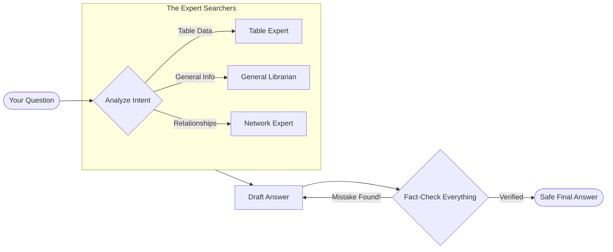

# 🏦 Unify — The AI Financial Truth Engine

> **Never trust a lying AI again.** Unify is a specialized "Fact-Checking" AI system designed specifically for financial documents. It doesn't just guess answers; it cross-references them against your actual data using three different "expert" modes to ensure 100% accuracy.

---

## 🌟 Why Unify? (The Non-Tech Explanation)

Most standard AI (like ChatGPT) can "hallucinate"—they sometimes confidently state wrong numbers or dates because they are just predicting the next word. In finance, a single wrong digit can be a disaster.

**Unify fixes this by:**
1.  **Reading like a Human**: It understands the difference between a general question, a complex table of numbers, and a relationship between companies.
2.  **Specialized Searching**: It uses three different "brains" to find information, whether it's hidden in a messy PDF table or a complex corporate structure.
3.  **The Fact-Checker**: Before you see an answer, an invisible "Verifier" breaks the answer into tiny pieces and checks every single number against the original document. If it’s not 100% true, it won't show it to you.

---

## 🧭 How it Works (The Simple Flow)

Imagine Unify as a high-end Research Team:

1.  **The Receptionist (Intent Classifier)**: Listens to your question and decides which expert to call. Is it a question about numbers? A general summary? Or how two companies are related?
2.  **The Experts (Search Engines)**: 
    *   **The Table Expert**: Best at reading complex spreadsheets and PDF grids.
    *   **The Librarian**: Best at finding general text and specific sentences.
    *   **The Relationship Expert**: Best at connecting dots (e.g., "How does this CEO's history affect this other company?").
3.  **The Drafter (LLM)**: Writes a nice, easy-to-read answer based on what the experts found.
4.  **The Auditor (Hallucination Guardrail)**: The most important part. It takes the draft, checks every number, name, and date against the source, and only releases the answer if it is perfectly accurate.

### 📊 The Process Flow


---

## 🚀 Getting Started (For the Tech Team)

If you're setting this up for your company, here is the quick guide:

### 1. Installation
```bash
git clone https://github.com/tanishq450/Unify.git
cd Unify
python3 -m venv .venv && source .venv/bin/activate
pip install -r requirements.txt
```

### 2. Setting up your Keys
Create a file named `.env` and add your API keys (see `.env.example`). You will need access to an LLM provider and a Qdrant/Neo4j instance if using advanced features.

### 3. Usage Modes
*   **Web Dashboard**: Run `python3 api.py` to start the web interface.
*   **Chat Mode**: Run `python3 main.py interactive [your_folder]` to chat directly with your files.
*   **Safety Check**: Run `python3 evaluation.py` to see a report of how accurate the system is.

---

## 📁 What's Inside? (The Map)

*   `api.py`: The engine that powers the web interface.
*   `main.py`: The main control center for the AI.
*   `implementations/`: The "Brains" of the system (how it searches, how it fact-checks).
*   `evaluation.py`: The testing lab where we measure accuracy.
*   `utils/`: Tools for reading PDFs and cleaning data.

---

## 🛠️ Tech Stack (The Engine Parts)

*   **Intelligence**: GPT-4o / Claude 3.5
*   **Memory**: Qdrant (Vector Database) & Neo4j (Graph Database)
*   **Language**: Python 3.10+
*   **Safety Framework**: FinGround Atomic Verification

---


