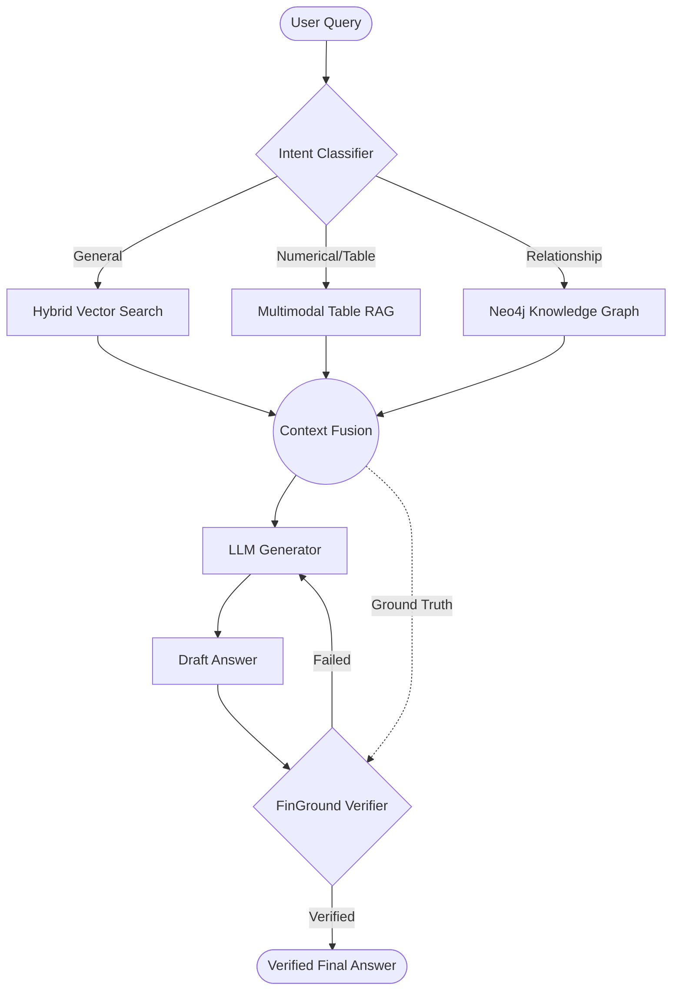

# 🏦 Unify — Intelligent Finance RAG

> **The ultimate guardrail for financial intelligence.** A multi-strategy Retrieval-Augmented Generation system designed to eliminate hallucinations in financial document analysis.

[](https://fastapi.tiangolo.com/)
[](https://qdrant.tech/)
[](https://neo4j.com/)
[](https://www.python.org/)

Unify is not just another RAG pipeline. It's a production-grade orchestrator that routes financial queries to specialized retrieval engines—hybrid vector search, knowledge graphs, or multimodal table extraction—and subjects every LLM-generated claim to rigorous atomic verification before it reaches the user.

---

## ✨ Key Features

| Feature | Description |
|---|---|
| **🧠 Intent-Based Routing** | Dynamically classifies queries into 6 categories (Trend, Numerical, Relationship, etc.) to select the optimal RAG strategy. |
| **🔍 Hybrid Retrieval** | Combines BM25 keyword search with dense semantic search using Qdrant RRF fusion for maximum recall. |
| **📊 Table-Aware RAG** | Preserves structural integrity of financial tables using LlamaParse and GPT-4V, preventing "row-blindness" in LLMs. |
| **🕸️ Graph RAG** | Leverages Neo4j knowledge graphs for complex multi-hop reasoning (e.g., "How do supplier disruptions affect Apple's Q3 margin?"). |
| **✅ Hallucination Guardrails** | **FinGround**-inspired verifier decomposes answers into atomic claims and cross-references them against source context. |
| **🎯 Advanced Reranking** | Uses `bge-reranker-v2-m3` cross-encoders and MMR (Maximum Marginal Relevance) to ensure precision and diversity. |

---

## 🏗️ Architecture



---

## 📁 Project Structure

```text
.
├── api.py                   # FastAPI Server (Production Entrypoint)
├── main.py                  # CLI Orchestrator & REPL
├── evaluation.py            # Comprehensive Evaluation Suite
├── Model_loader/            # LLM & Embedding Model initializers
├── implementations/         # Core Logic
│   ├── intent_classifier.py # Query Routing Logic
│   ├── Rag.py               # Standard Hybrid RAG
│   ├── Graph_rag.py         # Knowledge Graph Implementation
│   ├── hallucination_verifier.py # FinGround verification logic
│   └── multimodal_table_extractor.py # PDF Table parsing
├── qdrant/                  # Vector DB wrappers
└── utils/                   # Data Ingestion & PDF Processing
```

---

## 🚀 Getting Started

### 1. Installation

```bash
git clone https://github.com/tanishq450/Unify.git
cd Unify
python3 -m venv .venv && source .venv/bin/activate
pip install -r requirements.txt
```

### 2. Environment Setup

Create a `.env` file from the example:
```bash
cp .env.example .env
```
Key variables required: `MESH_API_KEY`, `QDRANT_URL`, and (optional) `NEO4J_URI`.

### 3. Running the System

#### **Option A: Web API (Recommended)**
Start the FastAPI server for production-like access:
```bash
python3 api.py
```
Access interactive docs at `http://localhost:8000/docs`.

#### **Option B: Interactive CLI**
Chat directly with your documents:
```bash
python3 main.py interactive my_collection
```

#### **Option C: Evaluation**
Run the full benchmark suite to verify accuracy:
```bash
python3 evaluation.py --component all --verbose
```

---

## 🛠️ API Reference

| Endpoint | Method | Description |
|---|---|---|
| `/ingest` | `POST` | Upload and process a PDF into the vector/graph store. |
| `/query` | `POST` | Execute a multi-strategy query with hallucination check. |
| `/evaluate` | `POST` | Trigger background evaluation of system components. |

**Sample Query Request:**
```json
{
  "query": "What was Apple's R&D spend in 2024 vs 2023?",
  "collection_name": "apple_10k"
}
```

---

## 🧪 Evaluation Suite

Unify includes a rigorous evaluation framework (`evaluation.py`) that tracks:

1.  **Intent Classification Accuracy**: Measures how well the router selects the correct strategy.
2.  **Verification Rate**: Percentage of LLM claims that are successfully verified against source docs.
3.  **Faithfulness Score**: A composite metric measuring the density of verified vs. unverified claims.
4.  **Latency Benchmarks**: P95 response times for each stage of the pipeline.

---

## ⚙️ Tech Stack

- **Core**: LlamaIndex, LangChain
- **LLMs**: GPT-4o-mini (via MeshAPI), Claude 3.5 Sonnet
- **Vector Store**: Qdrant (Hybrid Search + RRF)
- **Graph Store**: Neo4j
- **Embeddings**: OpenAI `text-embedding-3-small`, BGE Sparse
- **Verification**: Atomic Claim Decomposition (FinGround Pattern)
- **Parsing**: LlamaParse, pdfplumber, PyMuPDF

---

## 📄 License

MIT License. See `LICENSE` for details.


