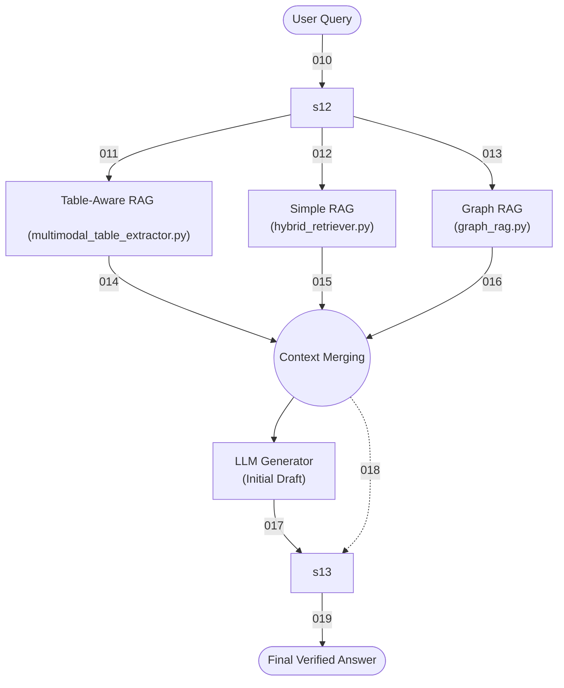

# Main.py Architecture: Unified Finance RAG Orchestrator

The `main.py` file serves as the central brain and orchestrator for the entire Finance RAG Architecture. It connects the query routing, the specialized retrieval engines, the LLM generation, and the final hallucination verification into a single, cohesive pipeline.

## System Workflow Diagram

## Component Breakdown

### 1. The Query Router (`AdaptiveRouter`)
**Role:** The Traffic Cop.
**Action:** Analyzes the incoming user query using rule-based keyword matching (and historical feedback thresholds). It categorizes the intent (e.g., `NUMERICAL_TABLE`, `TREND`, `GENERAL_KNOWLEDGE`) and decides which retrieval engine is best suited for the job.

### 2. The Retrieval Engines (The Searchers)
Based on the Router's decision, one of three specialized engines is triggered:
*   **Table-Aware RAG (`MULTIMODAL_RAG`):** Extracts full Markdown-formatted tables directly from PDFs, ensuring row/column structures are preserved for accurate numerical data.
*   **Simple RAG (`SIMPLE_RAG`):** Uses a Hybrid Retriever (BM25 keyword search + FAISS Semantic search) wrapped with a Cross-Encoder Reranker to find highly relevant text chunks.
*   **Graph RAG (`GRAPH_RAG`):** Extracts named entities and traverses a knowledge graph (e.g., Neo4j) to find hidden relationships between companies, suppliers, and executives.

### 3. The Generator (LLM)
**Role:** The Drafter.
**Action:** Takes the specific context retrieved by the engines and drafts an initial, conversational answer to the user's question. 

### 4. The Hallucination Verifier (`FinGroundVerifier`)
**Role:** The Fact-Checker.
**Action:** Before the draft answer is ever shown to the user, this component breaks the draft down into atomic facts (Atomic Claims). It compares every single number, date, and percentage against the original retrieved context. If the LLM hallucinated a number, the verifier strips it out and forces the LLM to regenerate a safe, accurate final answer.

## Data Flow Step-by-Step
1. **Input:** User asks: *"Show me the operating margin breakdown for Apple in 2024"*
2. **Routing:** `main.py` passes this to `AdaptiveRouter`, which flags it as `NUMERICAL_TABLE`.
3. **Retrieval:** `main.py` directs traffic to `TableAwareRAG`.
4. **Context:** `TableAwareRAG` searches the document store and returns Markdown grids of Apple's 2024 margins.
5. **Drafting:** `main.py` asks the LLM to generate an answer based *only* on those grids.
6. **Verification:** The LLM's draft is sent to `FinGroundVerifier`. The verifier recalculates the margins and ensures the numbers perfectly match the Markdown grids.
7. **Output:** The verified, hallucination-free response is returned to the user.
